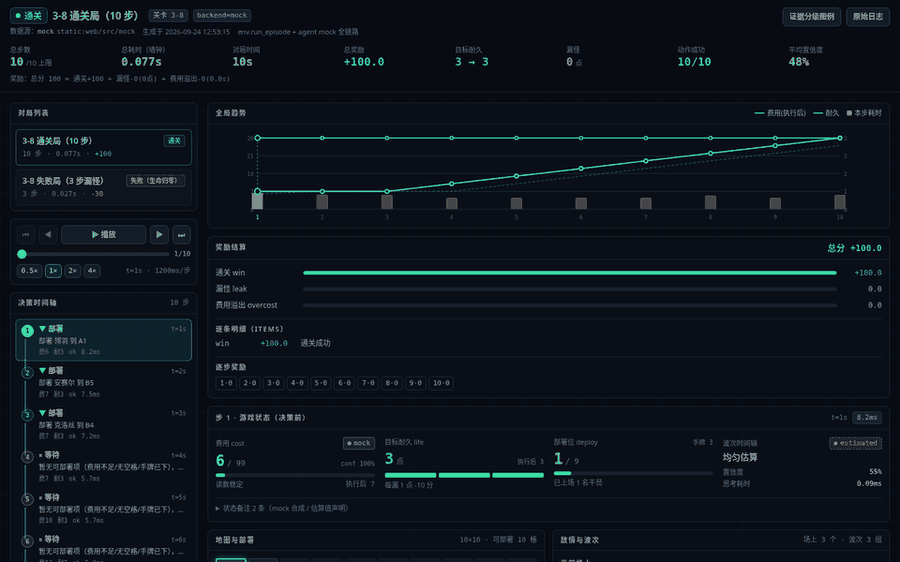
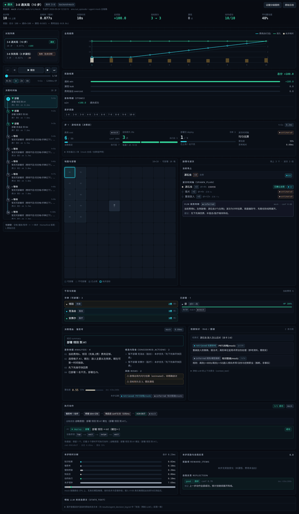
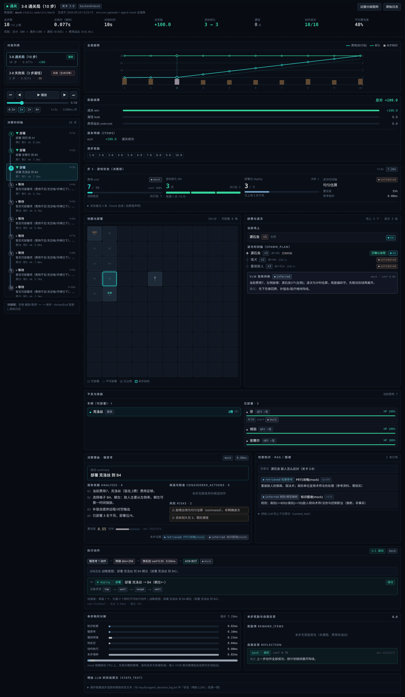
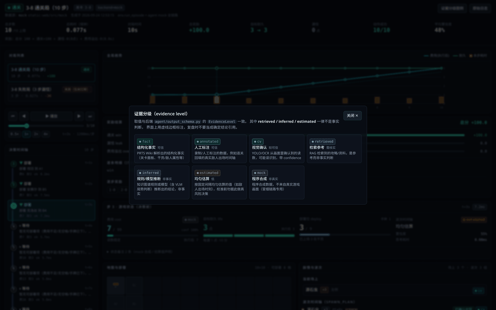
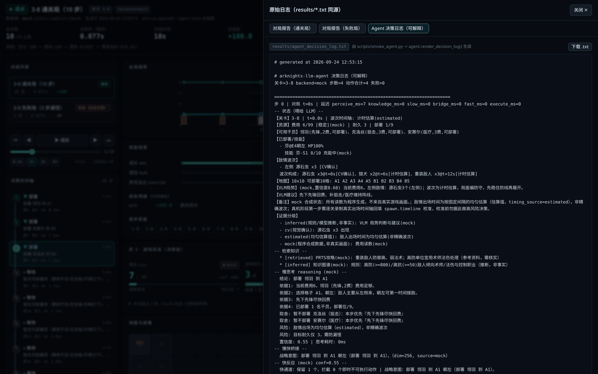
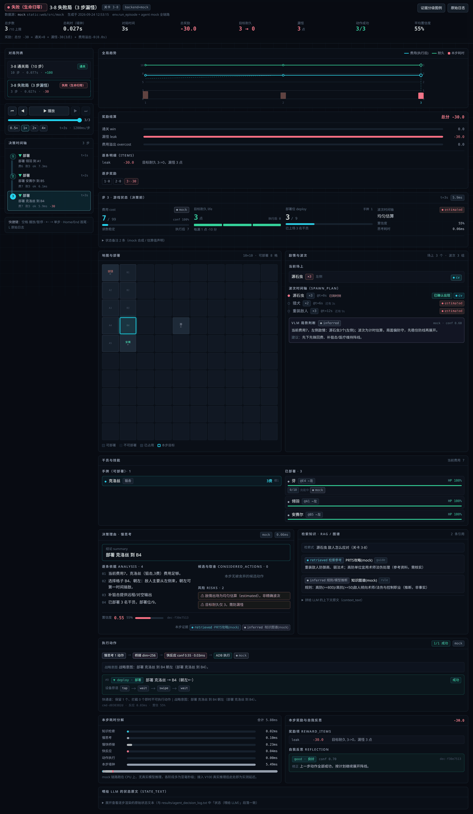

# 对局回放界面（web/）

把 `results/episode_report_*.txt` 与 `results/agent_decision_log.txt` 里的对局数据，渲染成**可播放、可解释**的可视化时间轴：每一步都能看到游戏状态（费用 / 敌人 / 干员 / 地图）、慢思考的决策理由、实际执行的动作与设备原语、各阶段耗时，并用彩色标签区分证据分级（`fact` / `retrieved` / `inferred` / `cv` / `estimated` / `annotated` / `mock`）。

技术栈：**React 18 + Vite 5 + Tailwind CSS 3**，零图表库依赖（趋势图与耗时条为手写 SVG / CSS）。



---

## 效果预览

| | |
|---|---|
| 总览：顶部汇总 + 全局趋势 + 奖励结算 + 左侧时间轴 |  |
| 单步详情：状态 / 地图 / 敌情 / 干员 / 决策理由 / 知识引用 / 执行 / 耗时 / 反思 |  |
| 证据分级图例（与后端 `EvidenceLevel` 一一对应） |  |
| 原始日志抽屉：直接看 `results/*.txt` 同源文本，可与可视化结果逐行对照 |  |
| 失败局：漏怪 3 点、耐久归零、总分 -30 |  |

---

## 快速开始

### 环境要求

- **Node.js >= 18**（开发时验证于 Node 24 + npm 11）
- 只有重新生成 mock 数据时才需要 Python（见下文「mock 数据」）

### 启动开发服务器

```bash
cd web
npm install
npm run dev          # http://127.0.0.1:5173
```

打开即用，默认走 mock 数据，不需要后端、不需要模拟器。

### 构建生产包

```bash
npm run build        # 产物在 web/dist
npm run preview      # 本地预览构建产物，默认 http://127.0.0.1:4173
```

`dist/` 是纯静态文件，直接丢给 Nginx / FastAPI 的 `StaticFiles` 挂载即可：

```python
# 后端顺手托管前端（可选）
from fastapi.staticfiles import StaticFiles
app.mount("/", StaticFiles(directory="web/dist", html=True), name="web")
```

### 全部命令

| 命令 | 作用 |
|---|---|
| `npm run dev` | 开发服务器（HMR，端口 5173） |
| `npm run build` | 生产构建到 `dist/` |
| `npm run preview` | 预览 `dist/` |
| `npm run export:mock` | 调 Python 重新导出 mock 数据（等价于 `python3 scripts/export_mock.py`） |

---

## 界面说明

### 顶部汇总（数据源：`GET /api/episode/{id}`）

通关 / 失败徽章、关卡、backend、总步数（含 `max_steps` 上限）、**总耗时（墙钟）**、对局时间、总奖励、目标耐久起止、漏怪点数、动作成功率、平均置信度，以及后端给出的奖励结算原句（`RewardBreakdown.summary_line()`）。

### 全局趋势

费用曲线（决策前读数虚线 + 执行后读数实线）、目标耐久、每步耗时柱，横轴为步序；**点图上任意位置直接跳到那一步**。

### 左侧时间轴

每步一个节点：动作类型图标与配色（部署 / 技能 / 撤退 / 等待）、`t=`对局时间、决策结论、当时费用与耐久、执行成功与否、本步延迟合计与奖励增量。节点之间的竖线颜色取该步主要证据级别。

### 回放控制

播放 / 暂停、上一步 / 下一步、跳首尾、进度滑块、0.5× / 1× / 2× / 4× 变速。播放到末步自动停止（复盘习惯，不循环），再按播放会从头开始。

快捷键：`空格` 播放暂停 · `←` `→` 单步 · `Home` `End` 首尾 · `L` 原始日志抽屉。

### 单步详情（数据源：`GET /api/episode/{id}/steps`）

按「看 → 想 → 打 → 解释」的顺序排列：

1. **游戏状态（决策前）**：费用（带 OCR 读数来源与 `ok/uncertain/missing` 状态）、目标耐久、部署位、波次时间轴可信度，并给出「执行后」读数对照；`notes` 里的 mock / 估算声明折叠展示。
2. **地图与部署**：10×10 网格，区分可部署 / 不可部署 / 已占用，本步目标格子高亮闪烁，已部署干员显示名字与朝向箭头。
3. **敌情与波次**：场上敌人（含 `cv` 视觉确认标签）+ `spawn_plan` 波次时间轴（已到 / 还有几秒）+ VLM 局势判断与战略建议（标 `inferred`）。
4. **干员与技能**：手牌按「当前费用够不够」实时着色；已部署干员显示格子、朝向、HP 条、技力文本与充能 / 可开启状态。
5. **决策理由**：结论 `summary`、逐条 `analysis`、候选取舍 `considered_actions`、风险 `risks`、置信度条。
6. **检索知识**：每条引用带证据分级徽章、`doc_type`、RAG 相似度、原文链接，并可展开拼给 LLM 的 `context_text` 原文。
7. **执行动作**：慢思考 plan → 桥接（`dim` / `source` / 战略意图）→ 快反应（`conf` / 被拦截动作）→ ADB 执行结果，逐动作展示类型、参数、成功失败与实际下发的**设备原语序列**（`tap → wait → swipe → wait`）。
8. **本步耗时分解**：感知 / 知识检索 / 慢思考 / 桥接 / 快反应 / 执行 的条形图 + 占比条。
9. **本步奖励与自我反思**：`reward_items` 逐条（`leak` / `overcost`）+ `reflection` 的 `verdict`（good / risky / bad）、`issues`、`adjustment`。
10. **喂给 LLM 的状态原文**：可展开 `state_text`，与 `agent_decision_log.txt` 中「状态（喂给 LLM）」段落逐字一致。

### 证据分级

配色与释义集中在 `src/constants/evidence.js`，取值与后端 `agent/output_schema.py` 的 `EvidenceLevel` 一致：

| 级别 | 含义 | 可信度 |
|---|---|---|
| `fact` | PRTS Wiki 解析出的结构化事实 | 可信 |
| `annotated` | 录制 / 人工标注（如真实出场时间轴） | 可信 |
| `cv` | YOLO / OCR 视觉确认读数 | 较可信（带 confidence） |
| `retrieved` | RAG 检索到的攻略资料 | **需核实，非事实** |
| `inferred` | 知识图谱规则 / 模型（含 VLM）推断 | **非事实** |
| `estimated` | 均匀估算值（如敌人出场时刻） | 低 |
| `mock` | 程序合成数据，不来自真实画面 | 非真实 |

`retrieved` / `inferred` / `estimated` 三级的徽章额外使用**虚线边框**，视觉上就和事实级区分开 —— 呼应项目里「检索与推断绝不允许被下游当成确定事实」的约束。波次来源 `timer:estimated` / `timer:annotated` / `vlm` 会自动映射到对应级别。

---

## 目录结构

```
web/
├── README.md                   # 本文件
├── package.json
├── vite.config.js              # 含 /api 代理（连真实后端时用）
├── tailwind.config.js          # 深色主题 + 证据分级配色
├── index.html
├── .env.example                # 环境变量样例（复制为 .env.local）
├── scripts/
│   └── export_mock.py          # ★ 从仓库 mock 全链路导出前端用 JSON
├── docs/images/                # README 用的截图与 GIF
└── src/
    ├── main.jsx / App.jsx      # 入口与整体布局、快捷键
    ├── api.js                  # ★ 数据访问层：mock <-> FastAPI 一键切换
    ├── config.js               # VITE_* 环境变量收敛处
    ├── index.css               # Tailwind 指令 + 卡片/按钮/滚动条样式
    ├── constants/
    │   ├── evidence.js         # 证据分级：颜色 + 释义（单一事实来源）
    │   └── ui.js               # 动作类型 / 结局 / 反思 / 延迟阶段 / 职业配色
    ├── utils/format.js         # 时间、数字、百分比格式化 + camelizeDeep
    ├── hooks/
    │   ├── useEpisode.js       # 对局列表与单局加载（含竞态保护、重试）
    │   └── usePlayback.js      # 回放播放控制（播放/暂停/变速/跳转）
    ├── mock/                   # ★ 静态 mock 数据（由 export_mock.py 生成）
    │   ├── episodes.json       #   对局列表
    │   ├── ep-3-8-win.json     #   通关局：10 步，+100
    │   ├── ep-3-8-lose.json    #   失败局：3 步漏怪，-30
    │   └── rawLogs.json        #   results/*.txt 同源原始文本
    └── components/
        ├── EpisodeHeader.jsx   # 顶部汇总
        ├── EpisodePicker.jsx   # 对局切换
        ├── TrendChart.jsx      # 费用/耐久/耗时趋势（手写 SVG，可点击跳转）
        ├── RewardPanel.jsx     # 奖励结算（win / leak / overcost + 逐步奖励）
        ├── PlaybackControls.jsx
        ├── TimelineRail.jsx    # 左侧时间轴
        ├── StepDetail.jsx      # 单步详情编排
        ├── StatePanel.jsx      # 费用/耐久/部署/波次可信度
        ├── MapGrid.jsx         # 地图网格与部署
        ├── EnemyPanel.jsx      # 敌情 + 波次时间轴 + VLM
        ├── OperatorRoster.jsx  # 手牌 + 已部署 + 技能
        ├── ReasoningPanel.jsx  # 决策理由
        ├── KnowledgePanel.jsx  # 检索知识与引用
        ├── ActionPanel.jsx     # 执行链路（想→桥→快→打）
        ├── LatencyPanel.jsx    # 耗时分解
        ├── ReflectionPanel.jsx # 本步奖励 + 自我反思
        ├── EvidenceBadge.jsx   # 证据分级彩色标签（统一入口）
        ├── EvidenceLegend.jsx  # 图例弹窗
        ├── RawLogDrawer.jsx    # 原始日志抽屉（可下载 .txt）
        └── ui.jsx              # Card / Stat / Tag / Bar / Empty / Spinner 等基础件
```

---

## mock 数据

`results/` 已被 `.gitignore` 排除，clone 下来是空的，所以 mock 数据**不是手写的**，而是由 `scripts/export_mock.py` 复用仓库现有 mock 组件跑出来的：

```bash
# 仓库根目录执行（依赖与冒烟测试相同：numpy / pydantic / pyyaml，无需 GPU 与模拟器）
python3 web/scripts/export_mock.py
```

脚本做的事：

1. 用 `env.mock_env.build_mock_env()` 装配 mock 全链路（感知 / 知识 / 慢思考 / 桥接 / 快反应 / 执行器）；
2. 按与 `ArknightsEnv.run_episode()` **完全相同的顺序**逐步跑完一局，额外把每步「决策前的结构化 `GameState`」「`KnowledgeBundle`」「`AgentDecision.reasoning`」「`BridgeState`」「`FastCommand`」「`PlanResult`」「`Reflection`」「`RewardItem`」一并留存；
3. 输出 camelCase JSON 到 `web/src/mock/`，并用 `env.render_episode_report()` / `agent.render_decision_log()` 重新渲染原始文本日志。

导出两局（与 `scripts/smoke_env.py` 的断言一致）：

| id | 结局 | 步数 | 总分 | 对应文件 |
|---|---|---|---|---|
| `ep-3-8-win` | win（通关） | 10 | +100 | `results/episode_report_win.txt` |
| `ep-3-8-lose` | defeat（耐久归零，漏怪 3 点） | 3 | -30 | `results/episode_report_lose.txt` |

改了 mock 感知 / 决策逻辑之后重跑一次这个脚本即可刷新前端数据。

> 两处刻意的数据裁剪：桥接的 256 维 mock 伪向量不入 JSON（对回放无意义）；地图拓扑 `terrain/deployable` 全局静态，只在 `episode.map` 存一份，每步只存会变的 `occupiedCells`。

---

## API 对接（后端上线时怎么切）

前端**只通过 `src/api.js` 取数**，组件不直接 `fetch`，所以切换后端不需要改任何界面代码。

### 约定的接口

| 方法 | 路径 | 返回 | 前端调用 |
|---|---|---|---|
| GET | `/api/episodes` | 对局列表 | `listEpisodes()` |
| GET | `/api/episode/{id}` | 对局报告（汇总 + 奖励 + 地图拓扑） | `fetchEpisode(id)` |
| GET | `/api/episode/{id}/steps` | 每步详情数组 | `fetchEpisodeSteps(id)` |
| GET | `/api/logs` | 原始文本日志（可选） | `fetchRawLogs()` |

回放界面实际用 `fetchEpisodeFull(id)`：并发请求上面两个接口再合并成 `{ episode, steps }`。

`/api/logs` 属于附加能力，后端没实现时会自动回落到本地 mock 日志，不会让界面报错。

### 切换方式

```bash
# 方式一：环境变量（推荐，不改代码）
VITE_USE_MOCK=false npm run dev

# 后端不在同源时再指定基地址
VITE_USE_MOCK=false VITE_API_BASE=http://127.0.0.1:8000 npm run build
```

或写进 `web/.env.local`（参考 `.env.example`，不入库）：

```
VITE_USE_MOCK=false
VITE_API_BASE=http://127.0.0.1:8000
```

`VITE_API_BASE` 留空即同源，开发期由 `vite.config.js` 的 proxy 把 `/api` 转发到 `http://127.0.0.1:8000`（FastAPI 默认端口），**不用配 CORS**；生产环境若前后端不同域，则需要后端开启 CORS。

### 后端返回结构（字段契约）

字段名与 `web/src/mock/*.json` 完全一致即可。FastAPI 若直接序列化 pydantic 模型输出 snake_case（`elapsed_sec`、`decision_summary`…），`api.js` 里的 `normalizeEpisode` / `normalizeStep` 会用 `camelizeDeep` 自动转成 camelCase，并对缺失字段兜底，**两种命名都能跑**。

`GET /api/episode/{id}`：

```jsonc
{
  "id": "ep-3-8-win",
  "title": "3-8 通关局（10 步）",
  "stageId": "3-8",
  "backend": "mock",
  "outcome": "win",              // win / defeat / timeout / aborted
  "outcomeLabel": "通关",
  "stepCount": 10,
  "durationSec": 0.087,          // 墙钟
  "gameTimeSec": 10.0,           // 对局内时间
  "maxSteps": 10,
  "stepDtSec": 1.0,
  "reward": {                    // 对应 RewardBreakdown
    "total": 100.0, "winBonus": 100.0, "leakPenalty": 0.0, "overcostPenalty": 0.0,
    "leaked": 0, "overcostSec": 0.0, "lifeStart": 3, "lifeEnd": 3,
    "summaryLine": "总分 100 = 通关+100 + 漏怪-0(0点) + 费用溢出-0(0.0s)",
    "items": [{ "name": "win", "delta": 100.0, "why": "通关成功" }]
  },
  "totals": {                    // 可选，前端有兜底
    "actionsTotal": 10, "actionsSucceeded": 10, "actionsFailed": 0,
    "avgConfidence": 0.48, "latencySumMs": { "slow_ms": 0.4, "execute_ms": 0.2 }
  },
  "map": { "cols": 10, "rows": 10, "cells": [ { "cellId": "A1", "col": 0, "row": 0, "terrain": "ground", "deployable": true } ] }
}
```

`GET /api/episode/{id}/steps`（数组，或 `{ "steps": [...] }` 也接受）：

```jsonc
[{
  "step": 1,
  "elapsedSec": 1.0,
  "state": {                     // 决策前的 GameState（perception.schemas.GameState）
    "stageId": "3-8", "timingSource": "estimated",
    "cost": { "current": 6, "limit": 99, "confidence": 1.0, "source": "mock", "state": "ok" },
    "lifePoints": 3, "deployUsed": 1, "deployLimit": 9,
    "operatorCards": [{ "name": "翎羽", "operatorClass": "先锋", "cost": 2, "slot": 0, "available": true }],
    "deployed": [{ "name": "芬", "cellId": "E4", "direction": "left", "hpRatio": 1.0 }],
    "skills": [{ "operator": "芬", "slot": 0, "ready": false, "active": false, "spText": "0/10", "source": "mock" }],
    "enemiesOnField": [{ "name": "源石虫", "observedCount": 3, "positionHint": "左侧", "source": "cv" }],
    "spawnPlan": [{ "enemy": "源石虫", "count": 3, "wave": 0, "expectedTimeSec": 0.0, "appeared": true, "confirmedBy": "cv" }],
    "occupiedCells": ["E4"],
    "notes": ["mock 合成状态：所有读数为程序生成…"],
    "vlm": { "situation": "…", "strategicAdvice": "…", "confidence": 0.6, "level": "inferred", "analyzer": "mock" },
    "stateText": "【关卡】3-8 | t=0.0s …"
  },
  "knowledge": { "query": "…", "contextText": "…",
    "citations": [{ "source": "PRTS攻略(mock)", "detail": "…", "evidence": "retrieved", "docType": "guide", "url": "", "score": null }] },
  "reasoning": { "summary": "部署 翎羽 到 A1", "analysis": ["…"], "consideredActions": ["…"], "risks": ["…"] },
  "decision": { "decisionId": "dec-af576e3c", "confidence": 0.55, "thinker": "mock", "thoughtMs": 0.09,
                "plan": { "actions": [{ "action": "deploy", "operatorId": "翎羽", "gridPos": "A1", "direction": "left" }], "reason": "…" } },
  "bridge": { "decisionId": "dec-af576e3c", "dim": 256, "hint": "…", "source": "mock" },
  "command": { "commandId": "cmd-383563ed", "reactor": "mock", "confidence": 0.55, "reactMs": 0.05,
               "dropped": [], "note": "快通道：保留 1 个、拦截 0 个…",
               "plan": { "actions": [ /* 同上 */ ] } },
  "execute": { "total": 1, "succeeded": 1, "failed": 0, "completed": true,
               "results": [{ "index": 0, "action": "deploy", "success": true, "status": "ok", "error": "", "ops": ["tap","wait","swipe","wait"] }] },
  "reflection": { "decisionId": "dec-af576e3c", "verdict": "good", "issues": [], "adjustment": "…", "confidence": 0.7 },
  "after": { "cost": 7, "life": 3 },             // 执行后读数
  "reward": { "stepReward": 0, "items": [] },
  "evidence": [{ "level": "retrieved", "source": "PRTS攻略(mock)" }],
  "latencyMs": { "knowledgeMs": 0.02, "slowMs": 0.1, "bridgeMs": 0.25, "fastMs": 0.06, "executeMs": 0.1, "stepMs": 7.9 }
}]
```

### 与后端模型的对应关系

| 前端字段 | 后端来源 |
|---|---|
| `episode.*` | `env.arknights_env.EpisodeLog`（`outcome` / `duration_sec` / `steps`） |
| `episode.reward.*` | `env.reward.RewardBreakdown`（含 `summary_line()`） |
| `episode.map` | `perception.schemas.GameMap`（静态拓扑，取首步快照） |
| `step.state.*` | `perception.schemas.GameState`（决策前那一帧） |
| `step.state.vlm` | `perception.schemas.VLMAnalysis` |
| `step.knowledge` | `agent.output_schema.KnowledgeBundle` / `KnowledgeCitation` |
| `step.reasoning` / `step.decision` | `agent.output_schema.AgentDecision`（`Reasoning`） |
| `step.bridge` | `agent.output_schema.BridgeState`（不含 256 维向量） |
| `step.command` | `agent.output_schema.FastCommand` |
| `step.execute` | `action.action_space.PlanResult` / `ActionResult`（`ops` 为设备原语序列） |
| `step.reflection` | `agent.output_schema.Reflection` |
| `step.after` / `step.reward` | `env.arknights_env.EnvStep`（执行后 `cost` / `life` / `reward_items`） |
| `step.latencyMs` | `EnvStep.latency_ms` + 导出脚本实测的 knowledge / bridge / fast / step 各段 |
| `step.evidence` | `EnvStep.evidence`（形如 `"level:source"`，已拆成对象） |

后端只要在 `EpisodeLog` / `StepRecord` 落库时按上表映射一层即可，不需要改 Agent 逻辑。

---

## 已知限制

- **mock 链路的耗时接近 0**：CPU 上没有真实模型推理，各阶段多为亚毫秒级，耗时面板看起来"很空"是符合预期的；接入 V100 真实推理后（慢思考通常是主要开销）这里才有诊断价值。面板上已就地标注说明。
- **失败局的费用曲线较短**：只有 3 步，趋势图会显得稀疏。
- **地图只有拓扑与占用**：mock 感知不提供敌人实时坐标，所以地图上不画敌人位置，敌情以「场上敌人 + 波次时间轴」形式呈现。真机阶段若补上 YOLO 的 bbox，`MapGrid.jsx` 里加一层敌人标记即可（`DetectedObject.bbox` 已在 schema 中）。
- 未做移动端适配到手机尺寸（最小可用宽度约 1024px），复盘场景以桌面为主。

---

## 版权说明

`src/mock/` 下的数据全部由仓库 mock 组件程序合成（`GameState.notes` 里也逐条声明了「不来自真实游戏画面」），不含任何 PRTS 爬取数据、游戏截图或游戏素材，可以安全入库。
